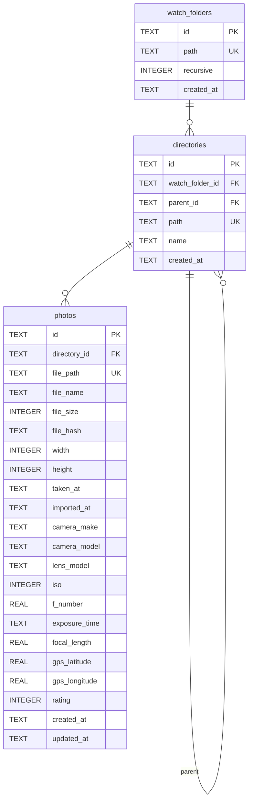

```mermaid
erDiagram
    watch_folders {
        TEXT id PK
        TEXT path UK
        INTEGER recursive
        TEXT created_at
    }

    directories {
        TEXT id PK
        TEXT watch_folder_id FK
        TEXT parent_id FK
        TEXT path UK
        TEXT name
        TEXT created_at
    }

    photos {
        TEXT id PK
        TEXT directory_id FK
        TEXT file_path UK
        TEXT file_name
        INTEGER file_size
        TEXT file_hash
        INTEGER width
        INTEGER height
        TEXT taken_at
        TEXT imported_at
        TEXT camera_make
        TEXT camera_model
        TEXT lens_model
        INTEGER iso
        REAL f_number
        TEXT exposure_time
        REAL focal_length
        REAL gps_latitude
        REAL gps_longitude
        INTEGER rating
        TEXT created_at
        TEXT updated_at
    }

    watch_folders ||--o{ directories : ""
    directories ||--o{ directories : "parent"
    directories ||--o{ photos : ""
```
